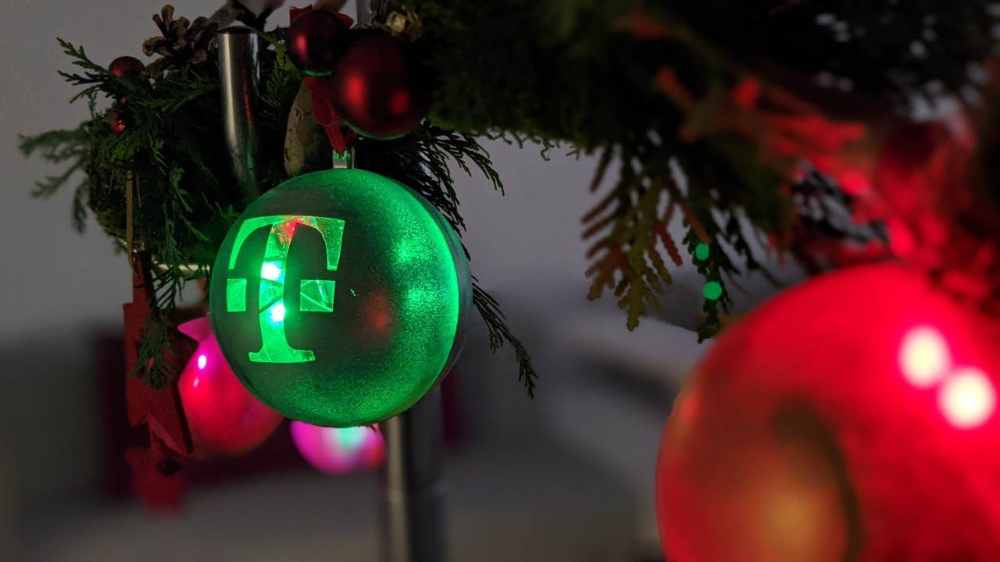

# OnsiteXmas
IoT Xmas Ball

## GIT Struktur

**Anleitung-Programmierung:** Programmieranleitung mit Hilfestellung zum Einrichten des ESP32, sowie hilfestellung zur Programmierung der LEDs

**Anleitung Weihnachtskugel:** Anleitung für das Zusammenbauen der Christbaumkugel

**Base Sketch:** Basis Sketch, welcher nur das OnsiteXmas BLE GATT Profil implementiet. Dieses wird benötigt, damit eine erfolgreiche Kommunikation mit der OnsiteXmas App gewährleistet werden kann! Das ansteuern der LEDs und das implementieren cooler Lichtspielen kann hiermit selbst probiert werden. Zur Unterstützung kann die Anleitung-Programmierung.pdf" herangezogen werden.

**Sample Solution:** fertiger Sketch, welcher auf den ESP32 geflasht werden kann, um die Christbaumkugel mit der onsiteXmas App zu steuern.